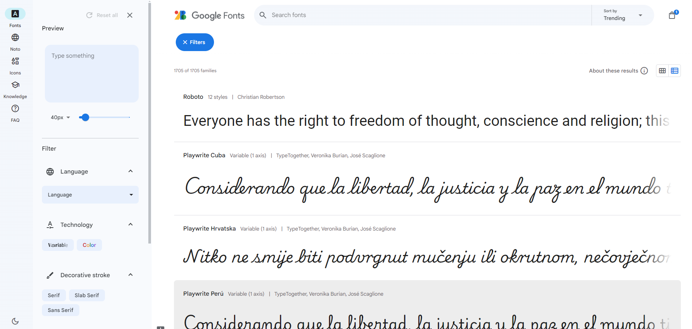

## Fonts ##  
updated 20240712  

### Google Fonts ###
[Google Fonts](https://fonts.google.com/) - библиотека бесплатных шрифтов, которые можно использовать в любых проектах, в том числе и коммерческих. В 2024 Google поменял интерфейс и добавил возможность работать с **переменными** шрифтами.  

  

Отфильтровать в просмотре переменные шрифты: Filters - Technology - Variable.  

